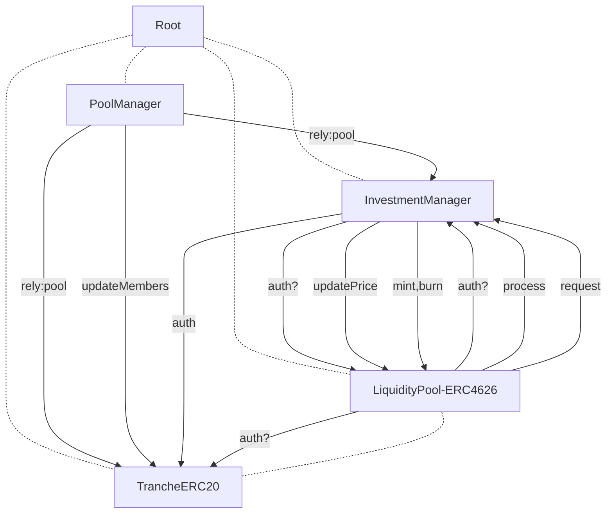

```mermaid 
graph TD

    Root -.- PoolManager
    Root -.- Tranche[TrancheERC20]
    Root -.- InvestmentManager
    Root -.- pool
    
    
    PoolManager --> |rely:pool| InvestmentManager
    PoolManager --> |rely:pool| Tranche

    
    PoolManager  --> |updateMembers| Tranche
    Tranche -.-  pool[LiquidityPool-ERC4626]
    

    InvestmentManager ----> |auth?| pool
    InvestmentManager ----> |updatePrice| pool
    InvestmentManager ----> |mint,burn| pool
    InvestmentManager --> |auth| Tranche

    pool --> |auth?| Tranche
    pool --> |auth?| InvestmentManager

    pool --> |process| InvestmentManager
    pool --> |request| InvestmentManager

```