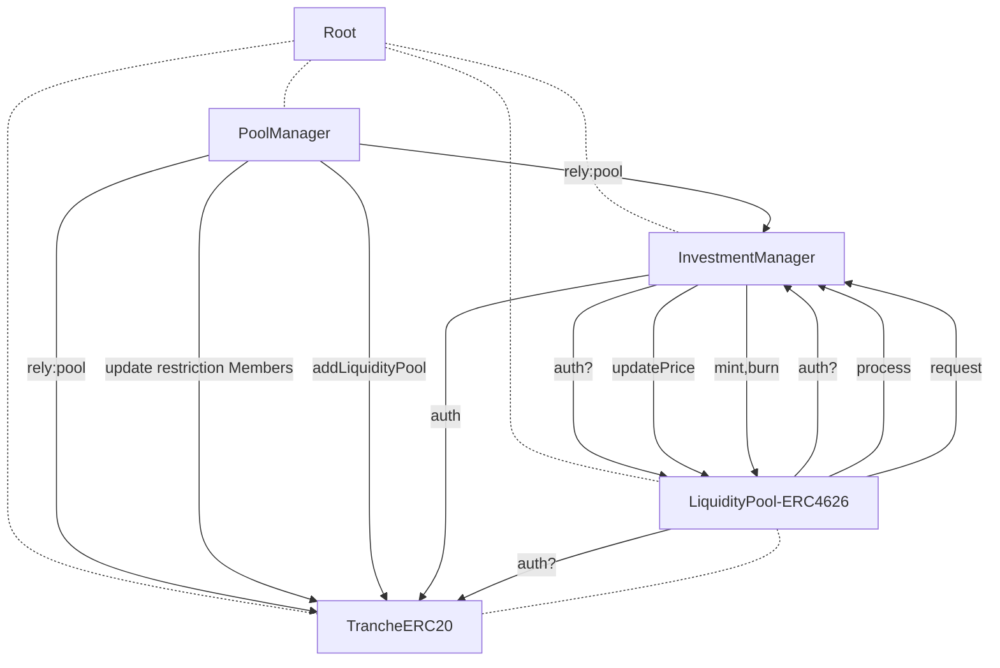

# Exploits `LiquidityPool.sol` arbitrary call. Anyone can steal `Tranche.sol` authentication access.

Centrifuge use simply Auth contract that have one level of authentication share among multiple contract. Instead of using modifier `onlyThisSpecificContract`, Centrifuge use simple `auth` modifier everywhere. Following the composite design pattern, each `auth` contract only allowed to call function known beforehand.

With the exception of `LiquidityPool.sol` contract for some whatever reason, it have arbitrary external call to `Tranche.sol` contract.

## Impact

Here are the things attacker can do when having `auth` access to `Tranche.sol` contract:

- Whitelisting themselves by changing `restrictionManager` contract
- Bypassing `isTrustedForwarder` check.
- Have full access to `mint` and `burn` function. Can mint/burn any amount of `Tranche` ERC20 token.
- `InvestmentManager.sol` depend on `Tranche.restrictionManager` check for membership. So attacker can bypass any `checkTransferRestriction` checks.
- Directly withdraw,redeem Tranche token into real token.
- Bypass `InvestmentManager` restriction allow access to Gateway call along with infinite token funds. Allowing use `Tranche` funds from one chain and make crosschain message to Centrifuge blackbox. Possibly steal funds from other chain too.

## Proof of Concept

Here is relationship of whom have `auth` over another contract based on `PoolManager.sol` and `Factory.sol`

LiquidityPool was given `auth` access to `Tranche.sol` [here](https://github.com/code-423n4/2023-09-centrifuge/blob/512e7a71ebd9ae76384f837204216f26380c9f91/src/PoolManager.sol#L326)
Below is snippet of `LiquidityPool.sol` showing arbitrary call interact with `Tranche`
```solidity
    function transfer(address, uint256) public returns (bool) {
        (bool success, bytes memory data) = address(share).call(bytes.concat(msg.data, bytes20(msg.sender)));
        _successCheck(success);
        return abi.decode(data, (bool));
    }

    function approve(address, uint256) public returns (bool) {
        (bool success, bytes memory data) = address(share).call(bytes.concat(msg.data, bytes20(msg.sender)));
        _successCheck(success);
        return abi.decode(data, (bool));
    }

    function mint(address, uint256) public auth {
        (bool success,) = address(share).call(bytes.concat(msg.data, bytes20(address(this))));
        _successCheck(success);
    }
    
    function burn(address, uint256) public auth {
        (bool success,) = address(share).call(bytes.concat(msg.data, bytes20(address(this))));
        _successCheck(success);
    }
```

`LiquidityPool.sol` need mint,burn access because it proxy call from `InvestmentManager.sol` to `Tranche.sol`. As show in Centrifuge docs [here](https://github.com/code-423n4/2023-09-centrifuge/blob/512e7a71ebd9ae76384f837204216f26380c9f91/images/contracts.png).

`Tranche.sol` have unique `_msgSender()` transaction reading to differentiate between normal user and `InvestmentManager` execution. Hence using `bytes.concat` `bytes20(msg.sender)`
```
    function _msgSender() internal view virtual override returns (address sender) {
        if (isTrustedForwarder(msg.sender) && msg.data.length >= 20) {
            // The assembly code is more direct than the Solidity version using `abi.decode`.
            /// @solidity memory-safe-assembly
            assembly {
                sender := shr(96, calldataload(sub(calldatasize(), 20)))
            }//@audit sender here is `LiquidityPool` then msg.sender should be decided by `LiquidityPool`
        } else {
            return super._msgSender();
        }
    }
```

Because `msg.data` can be crafted by normal user

## Tools Used

manual

## Recommended Mitigation Steps