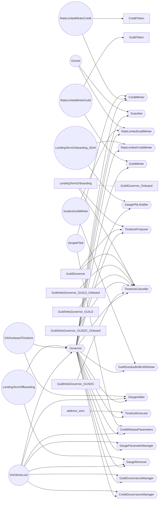

# analyzing

Do an audit on current smart contract project.
Does not follow read Readme.md first, but follow wild picking search for pattern first.

## Checklist

- [ ] follow GIP test file. Going through each smart contract one by one to see each one how it work.
- [ ] contract need initialization by Governor. Can contracts run without init? Is there enough check to prevent init error

## Notes

- 2 token. GUILD Token for control and CREDIT token for loan
- access control use immutable singleton. Both Role and singleton can change later by governor.
- Governor/multisig have payable multicall on all contracts.

## Contracts

- `Library` CoreRoles: keccak role for OZ access control
- `Main` Core: Setup role
- `abstract` CoreRef: inherit to get access control from Core.
- `Main` ProfitManager: config profit distribution. Holding token.

## Access control

