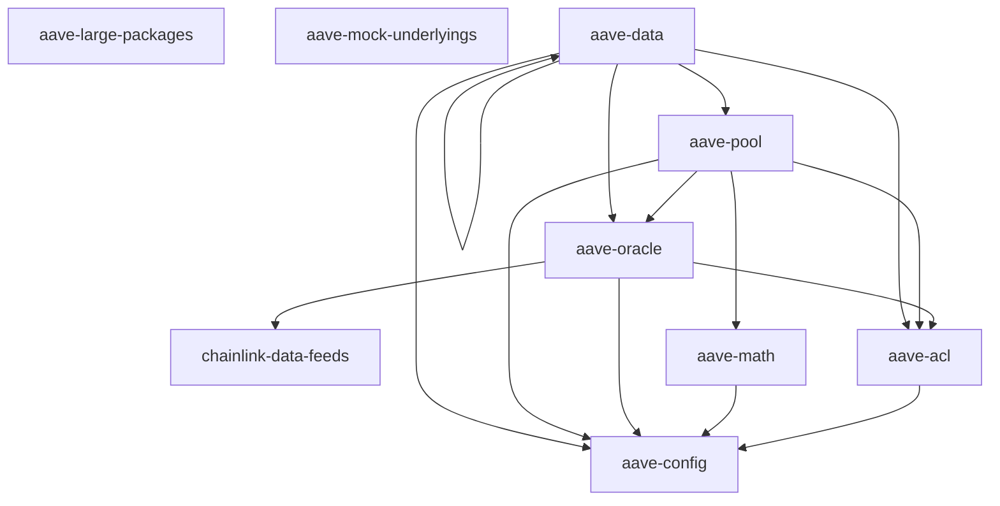

<div align="center">
    <a href="https://aptos.aave.com/">
      
    </a>
    <h1 align="center">Aave's V3 Protocol on Aptos</h1>
    <p align="center">
        This is the official Aptos version of the Aave V3 Protocol.
    </p>
    <p align="center">
        <a href="https://github.com/aave/aptos-aave-v3/actions/workflows/unit_tests.yml">
            
        </a>
        <a href="https://codecov.io/gh/aave/aptos-aave-v3">
          
        </a>
        <a href="https://github.com/aave/aptos-aave-v3/blob/main/LICENSE">
          
        </a>
    </p>
    <p align="center">
        <a href="https://aave.com/docs">📚 Documentation</a>
        <span>&nbsp;</span>
        <a href="https://github.com/aave/aptos-aave-v3/issues/new?labels=bug&template=bug-report---.md">🐛 Report Bug</a>
        <span>&nbsp;</span>
        <a href="https://github.com/aave/aptos-aave-v3/issues/new?labels=enhancement&template=feature-request---.md">✨ Request Feature</a>
    </p>
</div>

---

```bash=
├── aave-acl                // Access control list Package
├── aave-config             // Configurator Package
├── aave-data               // Data & Deployment Configurations
├── aave-large-packages     // Large Packages Package
├── aave-math               // Math library Package
├── aave-mock-underlyings   // Mock Underlyings Package
├── aave-oracle             // Oracle Package
├── aave-core               // Core Package
```

---

## 📊 Inter-package Dependency Graph



---

## 🚀 Getting Started

### 1. 🧩 Clone the Repository

```bash
git clone https://github.com/aave/aptos-aave-v3.git && cd aptos-aave-v3
```

---

### 2. 🛠️ Prerequisites

Make sure the following tools are installed:

- [Aptos CLI](https://aptos.dev/tools/aptos-cli/)
- [yq](https://github.com/mikefarah/yq)
- [Node.js + pnpm](https://pnpm.io/installation)
- [codespell](https://pypi.org/project/codespell/)
- [pre-commit](https://pre-commit.com/#install)
- [Python 3](https://www.python.org/downloads/)
- [GNU Make](https://www.gnu.org/software/make/)

---

## 🧪 Running a Local Testnet

### 🧰 Option 1: Using Makefile

Start by copying `.env.template` to `.env` and editing any relevant values.

#### ✅ Start the testnet

```bash
make local-testnet
```

#### ✅ With indexer (e.g. for Petra Wallet support)

```bash
make local-testnet-with-indexer
```

#### 🔧 Configure workspace

```bash
make set-workspace-config \
  && make init-workspace-config \
  && make init-profiles \
  && make init-test-profiles \
  && make fund-profiles \
  && make fund-test-profiles
```

This will initialize, configure, and fund local accounts with APT.

#### 🛠️ Compile & Deploy

```bash
make compile-all
make publish-all
```

#### 🌐 View your local testnet

[https://explorer.aptoslabs.com/?network=local](https://explorer.aptoslabs.com/?network=local)

---

### 🐳 Option 2: Using `aave-test-kit` (Docker)

[`aave-test-kit`](aave-test-kit/README.md) is a local simulation environment for Aave on Aptos, inspired by Tenderly.

➡️ See the linked README for Docker-based setup and usage.

---

## 🧪 Testing

### ✅ Run Unit Tests (Move)

These do **not require a local testnet**.

```bash
make test-all
```

---

### 🔬 Run TypeScript Integration Tests

These must be run **after successful contract deployment**:

```bash
make ts-test
```

---

## 📝 Generate Aptos Move Docs

Generate full module documentation across all packages:

```bash
make doc-all
```

Docs will be generated under each package's `doc/` directory.

---

## 🧰 TypeScript SDK

A TypeScript SDK is available for interacting with the Aave V3 Protocol on Aptos directly from your applications.

### 📦 Install via npm

```bash
pnpm add @aave/aave-v3-aptos-ts-sdk
# or
npm install @aave/aave-v3-aptos-ts-sdk
```

### 📘 Explore the SDK

👉 **[View on npm](https://www.npmjs.com/package/@aave/aave-v3-aptos-ts-sdk)**
Browse available functions, types, and usage examples.

📖 For full usage details, please refer to the [README documentation](https://www.npmjs.com/package/@aave/aave-v3-aptos-ts-sdk#readme) on the npm package page.

---

## 🔐 Security Audits

All audit reports related to Aave's Move implementation on Aptos are stored in the `/audits` directory at the root of this repository.

### 📁 Audit Directory Structure

```bash
/audits
├── Certora Aave Aptos Core V3.0.2 Report.pdf
├── Certora Aave Aptos Core V3.1-V3.3 Report.pdf
└── Certora Aave Aptos Periphery V3.0.2 Report.pdf
├── Spearbit Aave Aptos Core V3.0.2 Report.pdf
├── Spearbit Aave Aptos Core V3.1-V3.3 Report.pdf
└── Spearbit Aave Aptos Periphery V3.0.2 Report.pdf
```

📂 [Browse Audit Reports](/audits)

---

## 📚 Aave Move Smart Contract Docs

Official documentation for Aave's Move-based smart contracts is now available via GitHub Pages.

The docs are auto-generated from each package and published using [MkDocs Material](https://squidfunk.github.io/mkdocs-material/), with clean navigation and search.

### 📥 Explore the Docs

👉 **[View Smart Contract Documentation](https://aave.github.io/aptos-aave-v3)**
Browse all modules, structs, functions, and events used across Aave's V3 Aptos packages.

---
