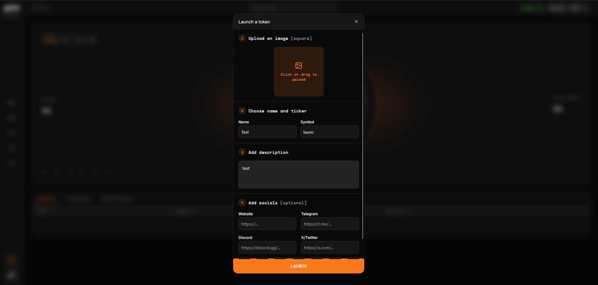

# It is very easy for bot take first buyer on LaunchPad .no pre-launch fronrun protection for meme token developer

## Links

## Finding description and impact

Here is GTE Launchpad project description

>The GTE token launcher is a permissionless system that allows anyone to boostrap liquidity to launch a token on GTE. Launches are fair, meaning that no tokens will be available for purchase by the team beforehand.

>When a token is launched, 80% of the token supply will be traded on a bonding curve

The bonding curve here is similar to uniswap AMM trading but without swap fee.
The earlier buyer simply have better price to purchase token.
Which also means, the first buyer cannot lose when buying a newly launch token, they can simply sell to recover original amount or sell for profit.

As a token creator, it make sense to be the first buyer of their own token.
But if we go through current GTE UX on `https://testnet.gte.xyz/`.

It normally take 30 seconds before a developer can reach the post-launch page to buy their own token.

Plentiful of time for a bot contract to snatch first buyer opportunity.
If developer buy token right after, the frontrun bot can simply sell token right away for profit. Because there is 0.005 ETH fee for launch new token, the bot never lose out if they managed to buy token first.

There is some code launch implemetnation that make bot job much easier to guess when there is new token launch without watching transaction events

```solidity
    function launch(string memory name, string memory symbol, string memory mediaURI)
        external
        payable
        nonReentrant
        returns (address token)
    {
        if (msg.value != launchFee) revert BadLaunchFee();

        address quote = address(currentQuoteAsset);
        IBondingCurveMinimal curve = currentBondingCurve;

        if (quote == address(0)) revert UninitializedQuote();
        if (address(curve) == address(0)) revert UninitializedCurve();

        token = address(new LaunchToken(name, symbol, mediaURI, gteRouter));//@audit M launch token address is predictable. This could be abused to instantly inflate value of a token before anyone can buy it.

        curve.initializeCurve(token, TOTAL_SUPPLY, BONDING_SUPPLY);
        distributor.createRewardsPair(token, quote);

        _launches[token] = LaunchData({active: true, curve: curve, quote: quote});

        emit TokenLaunched({
            dev: msg.sender,
            token: token,
            quoteAsset: quote,
            bondingCurve: curve,
            timestamp: block.timestamp,
            eventNonce: LaunchpadEventNonce.inc()
        });

        LaunchToken(token).mint(TOTAL_SUPPLY);//@audit no protection for dev creator to buy their asset first. Someone can simply snap up new token and sell it before dev get a chance to quickbuy their own
    }
```

First issue here is use CREATE contract opcode instead of CREATE2.
Any bot can run frontrun transaction on same block a new token is launched.
By checking if new contract nonce is not empty code,
if contract token exist then check if token already have buyer, if not then just snatch token away.

Second is event emit watch by bot. Since MegaETH chain have 1 second block.
User taking 30seconds to buy new token on normal UI cannot compete with bot watching events transaction.
It simply much faster for bot to get first buy opportunity.

## Recommended mitigation steps

For a more fair launch, it is recommended to replace `CREATE` contract with `CREATE2` contract or replace `SimpleBondingCurve` to a more fair launch system without depending on whom buy first

## POC
